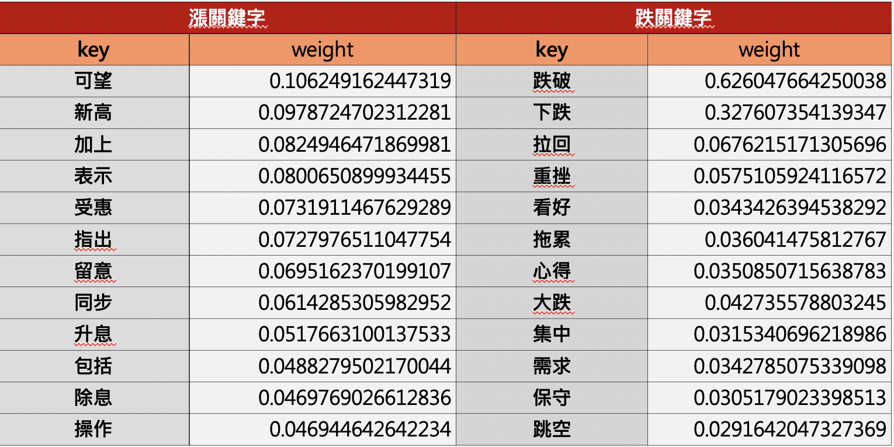
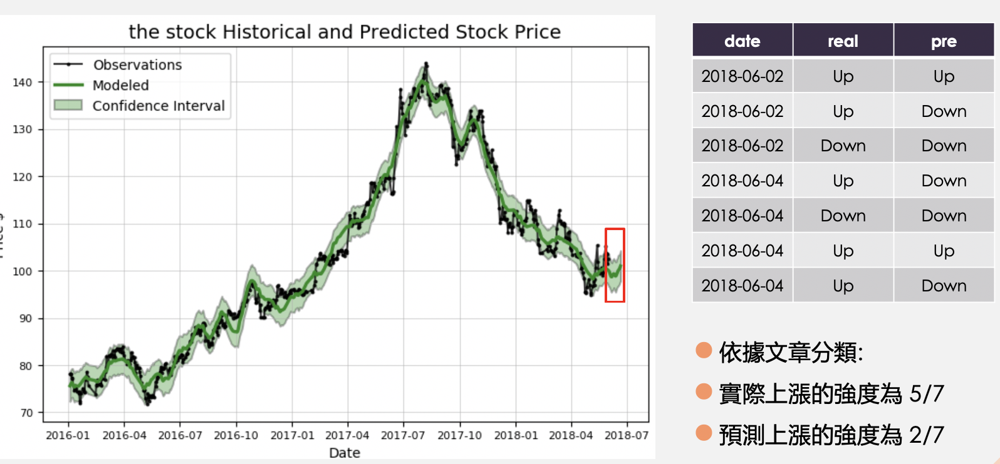

# FTIAS
## [Abstract]
利用財經新聞內文與標題輿情分析股票未來發展趨勢，其中資料來源為臺灣科技大學107學年度第二學期，課程代碼MI5227，合作企業提供之2016~2018年台灣股市資料與財經新聞資料。須在data/output位置導入以上資料，如有需要請聯繫spinning210@gmail.com。

## [Flow]]
1. 首先分類新聞，daily return = log( St / St-1 )，三天加總 > 1%分類為up；< 1%分類為down；others分類為useless。
2. 內文處理，將雜訊全部移除，雜訊包括數字、英文、特定字詞等。
3. jieba tf-idf找出不同文章分類中最多的情緒字詞
4. 正面反面字詞交叉比對

5. 尋找反轉點（反轉點 : 前20天平均與前5天平均之交叉），取反轉點前5天文章找關鍵字（概念為將這五天的新聞當做要發生反轉的輿情趨勢），回測這些關鍵字是否有正確的分類。
6. 使用CNN、Random Forest、MLP、XGB classifier、Logisic Regression實驗
7. 引用https://github.com/facebook/prophet 測試

